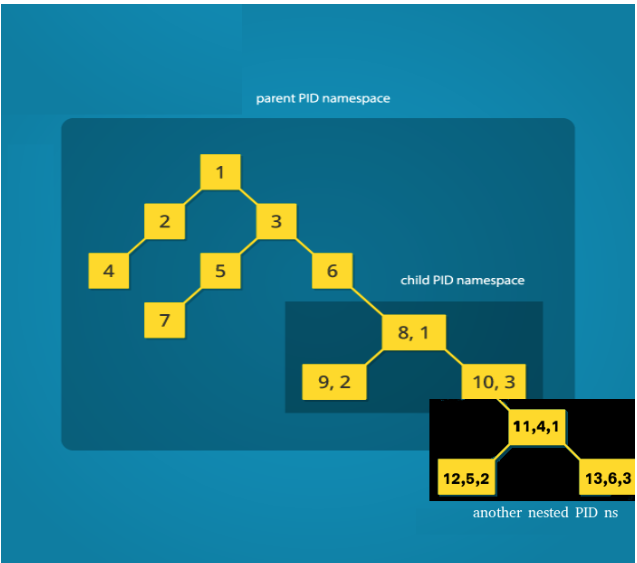
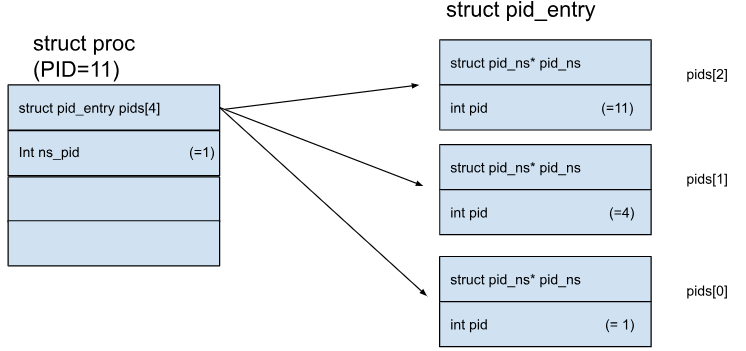
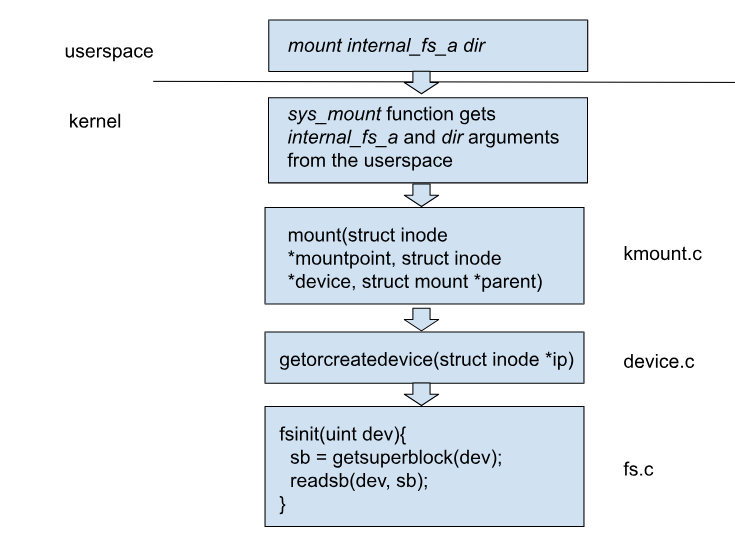

# Namespaces

## Namespaces - Preface
Namespaces implementation in xv6 resembles the way they are implemented in Linux. The xv6 counterpart of  Linux’s task_struct the proc holds a pointer to the namespace proxy object struct nsproxy *nsproxy containing references to the namespaces that the respective process belongs to:

```c
// Per-process state
struct proc {
  uint sz;               // Size of process memory (bytes)
  pde_t *pgdir;          // Page table
  char *kstack;          // Bottom of kernel stack for this process
  enum procstate state;  // Process state
  // int pid;
  int ns_pid;  // Process ID
  struct pid_entry pids[4];
  struct proc *parent;             // Parent process
  struct trapframe *tf;            // Trap frame for current syscall
  struct context *context;         // swtch() here to run process
  void *chan;                      // If non-zero, sleeping on chan
  int killed;                      // If non-zero, have been killed
  struct vfs_file *ofile[NOFILE];  // Open files
  struct vfs_inode *cwd;           // Current directory
  struct mount *cwdmount;          // Mount in which current directory lies
  char name[16];                   // Process name (debugging)
  struct nsproxy *nsproxy;         // Namespace proxy object
  struct pid_ns *child_pid_ns;     // PID namespace for child procs
  int status;                      // Process exit status
  char cwdp[MAX_PATH_LENGTH];      // Current directory path.
  struct cgroup *cgroup;           // The process control group.
  unsigned int cpu_time;           // Process cpu time.
  unsigned int cpu_period_time;    // Cpu time in microseconds in the last
                                   // accounting frame.
  unsigned int
      cpu_percent;  // Cpu usage percentage in the last accounting frame.
  unsigned int cpu_account_frame;  // The cpu account frame.
};

struct nsproxy {
  int ref;
  struct mount_ns* mount_ns;
  struct pid_ns* pid_ns;
};
```

xv6 has an upper limit of NNAMESPACE namespaces that can be created in the system.  The global namespacetable (defined in namespace.c) holds the information of all the xv6 namespaces. Access to the namespacetable is secured by a spinlock. struct nsproxy contains a reference counter and points to struct mount_ns and struct pis_ns. 

## PID Namespaces
New PID namespace is created by the unshare(PID_NS) system call. The calling process has a new PID namespace for its children which is not shared with any previously existing process. The calling process is not moved into the new namespace.  The first child created by the calling process will have the process ID 1 and will assume the role of init process in the new namespace. The pseudocode of unshare function is: 
- Reserve a row for a new namespace in the global namespacetable using allocnsproxyinternal function. If the number of namespaces exceeds NNAMESPACE the call results in ENOMEM[^1].
- Increase the reference count of the mount_ns and pid_ns structs. Note that myproc()->nsproxy points to the same namespaces (just increased the count).
- Reserve a new pid namespace (pid_ns_new function) and update the myproc()->child_pid_ns field to ensure that all calling process children will execute in a newly created namespace.

The pid_ns_new function reserves a row in a pidnstable (pid_ns.c). Actually all pid_ns structs are preallocated and as Pic 15 depicts, nsproxy[i] simply holds a pointer to the specific row in a global pidnstable. 

To complete the picture changes required in fork, kill and wait functions that  become pid namespace aware need to be mentioned. kill and wait will only operate using the pid that is visible in the namespace. fork, will create a new process as a PID namespace leader (init role) if myproc()->child_pid_ns is set by the unshare system call prior to fork.

### fork
fork 
Changes required in fork are related to the implementation of process ID mapping. xv6 PID namespaces implement the support of up to 4 nested namespaces. struct pid_entry pids[4] field in a per-process state describes the mapping. Let’s reveal how nesting is implemented based on the following example:


As one can observe, process IDs in the third namespace start from PID=1. However, for the namespace at the second level it is known as a PID=4, while in the parent PID namespace it holds PID= 11. Pic. 16 describes how the array pids[4] of struct pid_entry is holding the numbers. 



To make fork PID namespaces aware the following changes were introduced (bold font is used to indicate completely new code, italic is used for partially overlapped lines):

#### xv6-public fork - pseudocode
- Set struct proc current to point the current process
- Allocate process with allocproc for a child
- Copy process state from proc. Given a parent process's page table, create a copy of it for a child. Update a parent process, state and stack for a child process.
- Clear %eax so that fork returns 0 in the child.
- For every open file in the parent process Increment ref count using filedup
- Update cwd inode for a new process using idup 
- Copy parent’s name[16] to the child’s proc struct proc using safestrcpy (name is used for debugging purposes only)
- *Set pid to be np->pid* 
- Update np->state to be RUNNABLE (ptable.lock has to be acquired)
- Return pid 
#### PID namespace aware fork - pseudocode
 - **Fail if curproc->child_pid_ns && curproc->child_pid_ns->pid1_ns_killed**
- **Check if cgroup limit was reached when pid controller is enabled**
- **Check if cgroup reached its memory limit when memory controller is enabled**
- Set struct proc current to point the current process
- Allocate process with allocproc for a child
- Copy process state from proc. Given a parent process's page table, create a copy of it for a child. Update a parent process, state and stack for a child process.
- Clear %eax so that fork returns 0 in the child.
- For every open file in the parent process Increment ref count using filedup
- Update cwd inode for a new process using idup
- **Copy cwdp from the parent using safestrcpy**
- **Increase reference to the curproc->cwdmount using mntdup**
- **Update np->nsproxy**
- **For each one of MAX_PID_NS_DEPTH pid_ns update the corresponding pid (see pic 16)**
- Copy parent’s name[16] to the child’s proc struct proc using safestrcpy (name is used for debugging purposes only)
- *Set pid according to the namespace using get_pid_for_ns*
- Update np->state to be RUNNABLE (ptable.lock has to be acquired)
- Return pid

## Mount Namespaces
Mount namespaces facilitate an isolation of mount points. New mount namespace is created by the unshare(MOUNT_NS) system call.The calling process has a new mount namespace for its children which is not shared with any previously existing process. To handle mount namespaces the pseudocode of the unshare function described earlier. is amended with the following step:

- Create a new mount namespace (copymount_ns function) and update the myproc()->nsproxy->mount_ns field to ensure the calling process has a segregated view on mountpoints.

The copymount_ns function reserves a row in a mountnstable (mount_ns.c). Actually all mount_ns structs are preallocated and as Pic 15 depicts, nsproxy[i] simply holds a pointer to the specific row in a global mountnstable.

## Mountpoint related structures
Mount namesapces in xv6 are preallocated and accessible via the global mountnstable:

```c
#define NNAMESPACE 20

struct {
  struct spinlock lock;
  struct mount_ns mount_ns[NNAMESPACE];
} mountnstable;
```

The following diagram depicts what happens in the xv6 kernel when the command line mount utility call is issued on a preformatted file system[^2].


fsinit method results in reading a superblock from a device to a preallocated slot of superblocks. 
xv6 supports up to MAX_IDE_DEVS_NUM IDE devices and up to MAX_LOOP_DEVS_NUM loopback devices (preformatted internal_fs_a/b/c file can mounted as a block device)

```c
#define MAX_LOOP_DEVS_NUM (10)
#define MAX_IDE_DEVS_NUM (1)  // currently only one ide device is supported
#define MAX_OBJ_DEVS_NUM (3)

struct device {
  int ref;
  int id;
  enum device_type type;
  void* private;
  const struct device_ops* ops;
};

struct dev_holder_s {
  struct spinlock lock;  // protects loopdevs
  struct device devs[NMAXDEVS];
  uint devs_count[DEVICE_TYPE_MAX];
};
```

## cgroup in xv6
### memory.max
Configuration available in a non-root cgroup. After cgroup memory controller was enabled, “memory.max” will be available. This limit value stores an integer number which represents the maximum number of bytes that processes under this parent cgroup and all its children can get.
When a process moves to a cgroup with memory maximum definition and this process memory size is greater than memory.max, throw an error and do not proceed.
When a process that is inside a cgroup with memory maximum definition is being forked, check if a summary together with this new process memory size grows over the memory.max. Then it throws an error and aborts fork operation.
When a process tries to grow its memory, test for memory maximum configuration. When the new memory size of the process grows over memory.max abort with an error.
Value of -1 will remove the limit of memory.max.

### memory.min
Configuration available in a non-root cgroup. After cgroup memory controller was enabled, “memory.min” will be available. This limit value stores an integer number which represents the minimum number of bytes that processes under this parent cgroup and all its children can get.
When adding a new process with smaller size than memory.min, grow this new process memory size to match the memory minimum number of bytes.
When a process is being killed, check if the memory size of a cgroup processes and its children processes is lower than defined in memory.min. When it is lower, calculate the difference and appen this difference divided by the number of all processes in cgroup parent and its children.

### memory.failcnt
Configuration available in a non-root cgroup. After cgroup memory controller was enabled, “memory.failcnt” will be available. This counter increments every time a process tries to allocate more memory than the memory.max limit.

[^1]: Currently if the number of  namespaces exceeds NNAMESPACE the call results in kernel panic. The problem is reported in https://trello.com/c/4TN0ovsq/80-maman-12-system-call-error-conidtions.
[^2]:  Probably getorallocatedevice better describes what getorcreatedevice method aims to do since it operates on a preallocated dev_holder strut that holds superblocks for xv6 devices.
